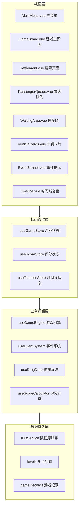
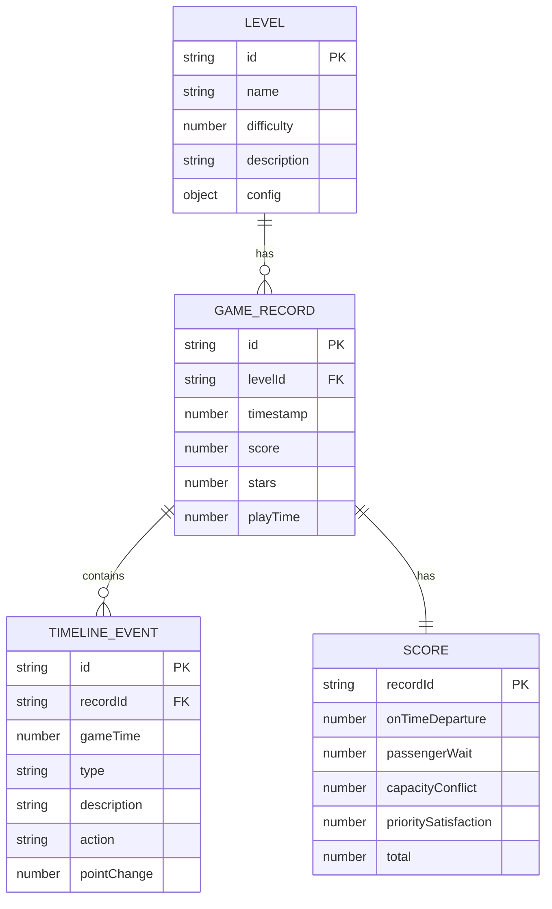

## 1. 架构设计



## 2. 技术描述

- **前端框架**: Vue 3.4 + TypeScript 5.4 + Vite 5.3
- **状态管理**: Pinia 2.1
- **路由**: Vue Router 4.3
- **样式**: TailwindCSS 3.4
- **图标**: Lucide Vue Next
- **拖拽**: 原生 HTML5 Drag and Drop API（无额外依赖）
- **数据库**: IndexedDB（通过 idb 库封装）
- **离线支持**: Vite PWA 插件
- **构建工具**: Vite 5.3

## 3. 路由定义

| 路由路径 | 页面组件 | 用途 |
|---------|----------|------|
| `/` | MainMenu.vue | 主菜单，关卡选择 |
| `/game/:levelId` | GameBoard.vue | 游戏主界面 |
| `/settlement/:recordId` | Settlement.vue | 结算页面 |
| `/records` | Records.vue | 历史记录页面 |

## 4. 数据模型

### 4.1 ER 图



### 4.2 核心类型定义

```typescript
// 乘客类型
interface Passenger {
  id: string;
  destination: string;
  priority: 'normal' | 'vip' | 'disabled';
  arrivalTime: number;
  status: 'pending' | 'arrived' | 'waiting' | 'boarded';
  waitingAreaId?: string;
  vehicleId?: string;
  boardTime?: number;
}

// 候车区类型
interface WaitingArea {
  id: string;
  name: string;
  capacity: number;
  destination: string;
  passengers: string[];
}

// 车辆类型
interface Vehicle {
  id: string;
  name: string;
  capacity: number;
  destination: string;
  scheduledDeparture: number;
  actualDeparture?: number;
  status: 'pending' | 'arrived' | 'boarding' | 'departed';
  passengers: string[];
  order: number;
}

// 事件类型
interface GameEvent {
  id: string;
  type: 'surge' | 'delay' | 'full' | 'priority_change';
  triggerTime: number;
  description: string;
  data: Record<string, any>;
  resolved: boolean;
}

// 时间线事件
interface TimelineItem {
  id: string;
  gameTime: number;
  type: 'passenger_arrive' | 'passenger_move' | 'vehicle_arrive' | 
        'vehicle_depart' | 'event_trigger' | 'score_change';
  description: string;
  action?: string;
  pointChange?: number;
}

// 关卡配置
interface LevelConfig {
  id: string;
  name: string;
  description: string;
  difficulty: number;
  passengerCount: number;
  vehicleCount: number;
  waitingAreas: Omit<WaitingArea, 'passengers'>[];
  passengers: Omit<Passenger, 'status' | 'waitingAreaId' | 'vehicleId' | 'boardTime'>[];
  vehicles: Omit<Vehicle, 'actualDeparture' | 'status' | 'passengers' | 'order'>[];
  eventPool: { type: GameEvent['type']; weight: number }[];
  eventFrequency: number;
}
```

## 5. 状态管理设计

### 5.1 useGameStore

```typescript
interface GameState {
  levelId: string;
  gameTime: number;
  isPaused: boolean;
  speed: number;
  status: 'idle' | 'playing' | 'ended';
  passengers: Passenger[];
  waitingAreas: WaitingArea[];
  vehicles: Vehicle[];
  activeEvents: GameEvent[];
  congestionRisk: number;
}

const actions = {
  startGame(levelId: string),
  pauseGame(),
  resumeGame(),
  setSpeed(speed: number),
  movePassengerToArea(passengerId: string, areaId: string),
  reorderVehicle(vehicleId: string, newOrder: number),
  triggerEvent(event: GameEvent),
  resolveEvent(eventId: string),
  updateGameTime(delta: number),
  endGame(),
};
```

### 5.2 useScoreStore

```typescript
interface ScoreState {
  onTimeDeparture: number;
  passengerWait: number;
  capacityConflict: number;
  prioritySatisfaction: number;
  total: number;
  stars: number;
  deductions: DeductionItem[];
}

interface DeductionItem {
  id: string;
  type: string;
  description: string;
  points: number;
  gameTime: number;
}
```

## 6. IndexedDB 数据库设计

### 6.1 数据库结构

```javascript
// 数据库名称和版本
const DB_NAME = 'shuttle_game_db';
const DB_VERSION = 1;

// 对象仓库定义
const stores = {
  levels: {
    keyPath: 'id',
    autoIncrement: false,
    indexes: [
      { name: 'difficulty', keyPath: 'difficulty', unique: false }
    ]
  },
  gameRecords: {
    keyPath: 'id',
    autoIncrement: false,
    indexes: [
      { name: 'levelId', keyPath: 'levelId', unique: false },
      { name: 'timestamp', keyPath: 'timestamp', unique: false },
      { name: 'score', keyPath: 'score', unique: false }
    ]
  },
  timelineEvents: {
    keyPath: 'id',
    autoIncrement: false,
    indexes: [
      { name: 'recordId', keyPath: 'recordId', unique: false },
      { name: 'gameTime', keyPath: 'gameTime', unique: false }
    ]
  }
};
```

### 6.2 数据库操作接口

```typescript
interface IDBService {
  init(): Promise<void>;
  getLevels(): Promise<LevelConfig[]>;
  getLevel(id: string): Promise<LevelConfig | undefined>;
  saveGameRecord(record: GameRecord): Promise<void>;
  getGameRecords(levelId?: string): Promise<GameRecord[]>;
  getBestRecord(levelId: string): Promise<GameRecord | undefined>;
  saveTimelineEvents(recordId: string, events: TimelineItem[]): Promise<void>;
  getTimelineEvents(recordId: string): Promise<TimelineItem[]>;
}
```

## 7. 核心业务逻辑

### 7.1 游戏引擎 (useGameEngine)

核心职责：
- 管理游戏时间推进
- 控制乘客状态变更（待到达 → 已到达 → 候车 → 已上车）
- 控制车辆状态变更（待到达 → 已到达 → 登车中 → 已发车）
- 检测游戏结束条件
- 协调事件系统触发

```typescript
function useGameEngine() {
  const gameTime = ref(0);
  const isPaused = ref(false);
  const speed = ref(1);
  let animationId: number | null = null;

  function tick(delta: number) {
    if (isPaused.value) return;
    gameTime.value += delta * speed.value;
    updatePassengerStatus();
    updateVehicleStatus();
    checkEventTriggers();
    checkGameEnd();
  }

  function updatePassengerStatus() {
    passengers.value.forEach(p => {
      if (p.status === 'pending' && p.arrivalTime <= gameTime.value) {
        p.status = 'arrived';
        addTimelineEvent('passenger_arrive', `乘客 ${p.id} 到达`);
      }
    });
  }

  function updateVehicleStatus() {
    vehicles.value.forEach(v => {
      if (v.status === 'pending' && v.scheduledDeparture - 30 <= gameTime.value) {
        v.status = 'arrived';
        addTimelineEvent('vehicle_arrive', `车辆 ${v.name} 到达`);
      }
      if (v.status === 'boarding' && shouldDepart(v)) {
        departVehicle(v);
      }
    });
  }
}
```

### 7.2 事件系统 (useEventSystem)

支持的事件类型：
1. **临时增员 (surge)**: 随机增加若干乘客立即到达
2. **车辆晚到 (delay)**: 某车辆发车时间延后
3. **候车区满员 (full)**: 某候车区容量临时减少
4. **优先级变更 (priority_change)**: 某乘客优先级提升/降低

```typescript
function useEventSystem() {
  const activeEvents = ref<GameEvent[]>([]);

  function triggerRandomEvent() {
    const eventType = selectWeightedEventType();
    const event = createEvent(eventType);
    activeEvents.value.push(event);
    addTimelineEvent('event_trigger', event.description);
    applyEventEffect(event);
  }

  function applyEventEffect(event: GameEvent) {
    switch (event.type) {
      case 'surge':
        addSurgePassengers(event.data.count);
        break;
      case 'delay':
        delayVehicle(event.data.vehicleId, event.data.delayMinutes);
        break;
      case 'full':
        reduceWaitingAreaCapacity(event.data.areaId, event.data.reduction);
        break;
      case 'priority_change':
        changePassengerPriority(event.data.passengerId, event.data.newPriority);
        break;
    }
  }
}
```

### 7.3 评分计算 (useScoreCalculator)

```typescript
function useScoreCalculator() {
  function calculateFinalScore(): Score {
    const onTimeScore = calculateOnTimeScore();
    const waitScore = calculateWaitScore();
    const conflictScore = calculateConflictScore();
    const priorityScore = calculatePriorityScore();

    return {
      onTimeDeparture: onTimeScore,
      passengerWait: waitScore,
      capacityConflict: conflictScore,
      prioritySatisfaction: priorityScore,
      total: Math.round(
        onTimeScore * 0.3 + 
        waitScore * 0.25 + 
        conflictScore * 0.2 + 
        priorityScore * 0.25
      ),
      stars: getStars(total)
    };
  }

  function calculateOnTimeScore(): number {
    let score = 100;
    vehicles.value.forEach(v => {
      if (v.actualDeparture && v.actualDeparture > v.scheduledDeparture) {
        const delay = v.actualDeparture - v.scheduledDeparture;
        const deduction = Math.floor(delay / 10) * 2;
        score = Math.max(0, score - deduction);
        addDeduction('late_departure', `车辆 ${v.name} 晚点 ${delay}秒`, deduction);
      }
    });
    return score;
  }
}
```

### 7.4 拖拽系统 (useDragDrop)

使用原生 HTML5 Drag and Drop API，封装为可复用的 composable：

```typescript
function useDragDrop() {
  function onDragStart(e: DragEvent, data: DragData) {
    e.dataTransfer!.setData('application/json', JSON.stringify(data));
    e.dataTransfer!.effectAllowed = 'move';
  }

  function onDragOver(e: DragEvent) {
    e.preventDefault();
    e.dataTransfer!.dropEffect = 'move';
  }

  function onDrop(e: DragEvent): DragData | null {
    e.preventDefault();
    const data = e.dataTransfer!.getData('application/json');
    return data ? JSON.parse(data) : null;
  }

  interface DragData {
    type: 'passenger' | 'vehicle';
    id: string;
    sourceAreaId?: string;
  }
}
```

## 8. 目录结构

```
src/
├── components/
│   ├── game/
│   │   ├── PassengerCard.vue
│   │   ├── PassengerQueue.vue
│   │   ├── WaitingArea.vue
│   │   ├── VehicleCard.vue
│   │   ├── VehicleList.vue
│   │   ├── EventBanner.vue
│   │   ├── ControlPanel.vue
│   │   └── CongestionWarning.vue
│   ├── menu/
│   │   ├── LevelCard.vue
│   │   └── LevelList.vue
│   └── settlement/
│       ├── ScoreCard.vue
│       ├── TimelineItem.vue
│       ├── TimelineList.vue
│       └── SuggestionCard.vue
├── composables/
│   ├── useGameEngine.ts
│   ├── useEventSystem.ts
│   ├── useScoreCalculator.ts
│   ├── useDragDrop.ts
│   └── useTimeline.ts
├── stores/
│   ├── gameStore.ts
│   ├── scoreStore.ts
│   └── timelineStore.ts
├── pages/
│   ├── MainMenu.vue
│   ├── GameBoard.vue
│   ├── Settlement.vue
│   └── Records.vue
├── router/
│   └── index.ts
├── utils/
│   ├── idb.ts
│   ├── levels.ts
│   ├── formatters.ts
│   └── helpers.ts
├── types/
│   └── index.ts
├── App.vue
└── main.ts
```
