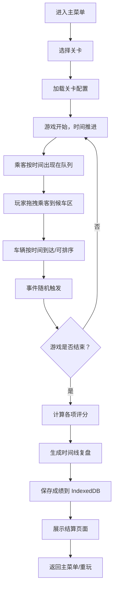

## 1. 产品概述

园区接驳车调度游戏是一款离线可玩的策略调度类网页游戏，玩家需要在车辆到达前合理安排乘客队列、候车区分配和车辆发车顺序，应对各类随机事件，最大化运营效率。

- 核心玩法：通过拖拽操作调度乘客和车辆，平衡准时性、乘客满意度和资源利用率
- 目标用户：喜欢策略调度类游戏的休闲玩家
- 产品价值：提供碎片化时间的策略思考乐趣，离线可玩无需网络

## 2. 核心功能

### 2.1 用户角色与权限
| 角色 | 核心权限 | 说明 |
|------|----------|------|
| 玩家 | 操作乘客队列、调整候车区、排序车辆 | 游戏主体操作者 |
| 提示系统 | 拥堵风险预警 | 只读提示，不干预操作 |
| 结算系统 | 展示得分和复盘 | 只读展示，不提供操作入口 |

### 2.2 功能模块
1. **主菜单模块**：关卡选择、历史成绩查看、游戏说明
2. **游戏主界面**：乘客队列、候车区状态、车辆卡片、事件提示区、控制面板
3. **事件系统**：临时增员、车辆晚到、候车区满员、乘客优先级变更
4. **结算系统**：得分展示、时间线复盘、扣分原因分析
5. **数据持久化**：IndexedDB 存储关卡成绩和游戏记录

### 2.3 页面详情
| 页面名称 | 模块名称 | 功能描述 |
|-----------|-------------|---------------------|
| 主菜单 | 关卡选择 | 展示4个关卡，显示关卡信息和历史最高分 |
| 主菜单 | 历史记录 | 查看过往游戏成绩和最佳表现 |
| 游戏界面 | 乘客队列区 | 显示待安排乘客，支持拖拽到候车区 |
| 游戏界面 | 候车区状态 | 多个候车区格子，显示已安排乘客和容量 |
| 游戏界面 | 车辆卡片区 | 显示待发车辆，支持调整发车顺序 |
| 游戏界面 | 事件提示区 | 显示当前事件和拥堵风险预警 |
| 游戏界面 | 控制面板 | 暂停/继续、时间加速、返回菜单 |
| 结算页面 | 得分总览 | 展示各项评分和总分 |
| 结算页面 | 时间线复盘 | 按时间顺序展示关键事件、玩家动作和扣分 |
| 结算页面 | 改进建议 | 基于本局表现给出优化方向 |

## 3. 核心流程

玩家流程：
1. 从主菜单选择关卡，查看关卡说明和目标
2. 游戏开始后，乘客按预设时间点出现在队列中（未到达的乘客不可操作）
3. 玩家将已到达的乘客拖拽到对应候车区
4. 车辆按时间到达，玩家可调整发车顺序
5. 随机事件触发时，玩家需要快速应对（如临时增员需要紧急安排）
6. 所有车辆发车后游戏结束，进入结算页面
7. 查看得分和时间线复盘，理解扣分原因
8. 返回菜单选择重玩或挑战下一关

## 4. 用户界面设计

### 4.1 设计风格
- **设计主题**：现代简约交通调度风格，采用深蓝和橙色为主色调
- **主色调**：深蓝 `#1e3a5f`（调度专业感），橙色 `#f59e0b`（警示和强调）
- **辅助色**：绿色 `#10b981`（正常），红色 `#ef4444`（警告/扣分），灰色 `#64748b`（中性）
- **按钮风格**：圆角矩形，微立体阴影，悬停有浮起效果
- **字体**：显示字体使用 `Noto Sans SC`，正文字体使用系统无衬线字体
- **布局风格**：卡片式布局，清晰的区域分隔，信息层级明确
- **图标风格**：使用 Lucide 图标库，线性风格，24px 为主

### 4.2 页面设计概述
| 页面名称 | 模块名称 | UI 元素 |
|-----------|-------------|-------------|
| 主菜单 | 关卡选择 | 4个关卡卡片，显示名称、难度、最高分、解锁状态 |
| 游戏界面 | 乘客队列 | 左侧垂直列表，乘客卡片显示目的地、优先级、到达时间 |
| 游戏界面 | 候车区 | 中间区域，3-4个候车区格子，每个格子显示容量、乘客列表 |
| 游戏界面 | 车辆卡片 | 右侧区域，可拖拽排序的车辆卡片，显示容量、目的地、发车时间 |
| 游戏界面 | 事件提示 | 顶部横幅，显示当前事件和处理倒计时 |
| 游戏界面 | 控制面板 | 底部控制栏，时间显示、暂停按钮、速度控制 |
| 结算页面 | 得分总览 | 顶部统计卡片，显示4项评分和总分，星级评价 |
| 结算页面 | 时间线 | 垂直时间轴，按时间顺序展示事件、动作、扣分 |
| 结算页面 | 改进建议 | 底部卡片，基于表现给出具体建议 |

### 4.3 响应式设计
- 桌面端优先设计，标准分辨率 1280px 及以上
- 平板端自适应布局，候车区和车辆区可调整为垂直排列
- 移动端简化交互，采用点击而非拖拽操作
- 所有触摸元素最小尺寸 44x44px，确保可点击

### 4.4 动效设计
- 乘客卡片拖拽时有半透明跟随效果
- 车辆排序时有平滑过渡动画
- 事件触发时有闪烁强调动画
- 页面切换采用淡入淡出过渡
- 扣分时有红色闪烁提示
- 游戏结束时有结算面板滑入动画

## 5. 关卡设计

### 关卡1：入门园区
- **车辆容量**：每车 8 人
- **到达节奏**：车辆每 2 分钟一班，共 5 班车
- **乘客数量**：30 人，每 30 秒到达 3 人
- **优先级规则**：普通乘客为主，10% 为 VIP 优先级
- **事件频率**：1-2 次随机事件
- **目标**：熟悉基本操作，无特殊难点

### 关卡2：早高峰
- **车辆容量**：每车 10 人
- **到达节奏**：车辆每 1.5 分钟一班，共 8 班车
- **乘客数量**：60 人，前 5 分钟密集到达
- **优先级规则**：20% VIP，5% 残障人士优先
- **事件频率**：3-4 次随机事件
- **难点**：乘客集中到达，候车区容易满员

### 关卡3：多线路调度
- **车辆容量**：6-12 人不等
- **到达节奏**：3 条线路，发车时间交错
- **乘客数量**：80 人，分属 3 个目的地
- **优先级规则**：不同线路有不同优先级权重
- **事件频率**：5-6 次随机事件
- **难点**：多目的地匹配，车辆容量不均

### 关卡4：极端天气
- **车辆容量**：正常 8 人，天气影响减至 6 人
- **到达节奏**：车辆晚到概率高，间隔不稳定
- **乘客数量**：100 人，有大量临时增员
- **优先级规则**：优先级频繁变更
- **事件频率**：8-10 次随机事件
- **难点**：频繁应对突发事件，资源紧张

## 6. 评分规则

| 评分项 | 权重 | 评分标准 |
|--------|------|----------|
| 准时发车 | 30% | 车辆按预定时间发车不扣分，每延迟 10 秒扣 2 分 |
| 乘客等待 | 25% | 乘客从到达到上车时间，超过 3 分钟每人扣 1 分 |
| 满员冲突 | 20% | 候车区满员后新乘客无法安排，每次扣 5 分 |
| 优先级满足 | 25% | 高优先级乘客优先上车，优先级顺序错误每人扣 3 分 |

- 总分 100 分，90+ 三星，80-89 两星，60-79 一星，60 以下无星
- 历史最高分自动保存，用于关卡解锁和成就系统
